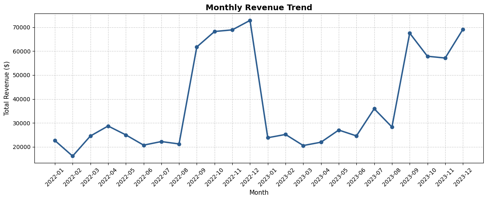
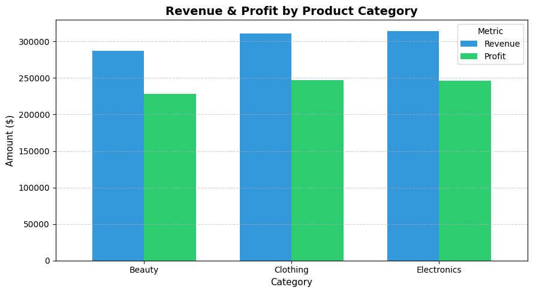
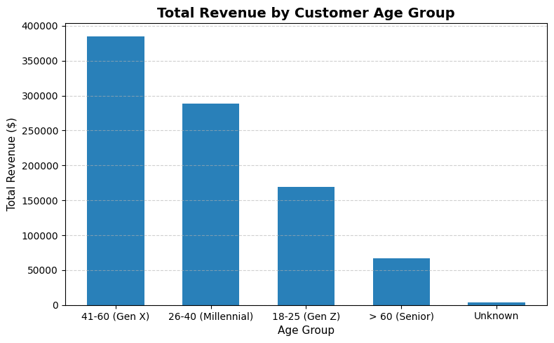
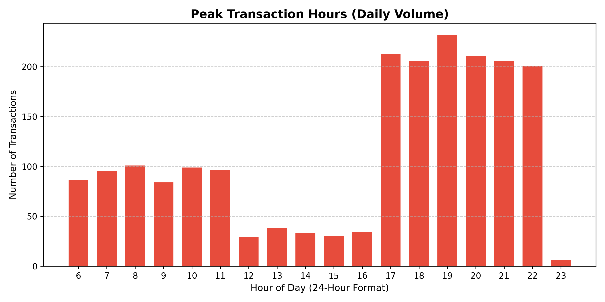

# 🛍️ Retail Sales and Customer Behavior Analysis (SQL & Python Project)

## 📌 Project Overview

This project provides an end-to-end retail sales and customer behavior analysis using **MySQL** for relational data querying and **Python (Pandas & Matplotlib)** for exploratory data analysis and visualization. 

The project covers data processing across 2,000 retail transaction records—from relational database setup, strict data cleaning, and explicit `NULL` handling to profitability analysis, customer demographic segmentation, and time-series sales trends.

The primary goal is to demonstrate practical analytics capabilities in answering key business questions, identifying profit drivers, and understanding customer purchasing habits.

---

## 📁 Repository Structure

```text
retail-sales-analysis/
│
├── SQL - Retail Sales Analysis_utf .csv      -- Raw transactional dataset (2,000 records)
├── RetailAnalysisProject.sql                 -- Consolidated SQL script (Schema + Cleaning + Analysis)
├── retail_analysis.ipynb                     -- Jupyter Notebook with complete data visualizations
└── README.md                                 -- Complete project documentation and findings
```
## 📊 Data Visualizations

### 1. Monthly Revenue Trend


### 2. Revenue & Profit by Product Category


### 3. Total Revenue by Customer Age Group


### 4. Peak Transaction Hours

